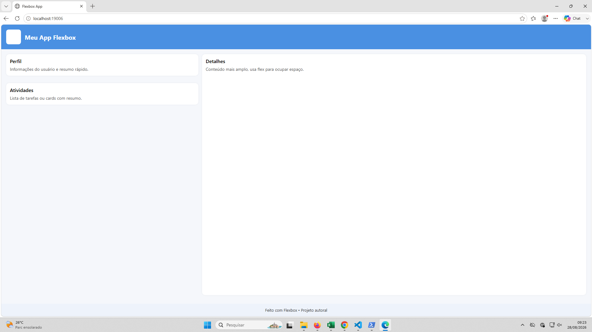
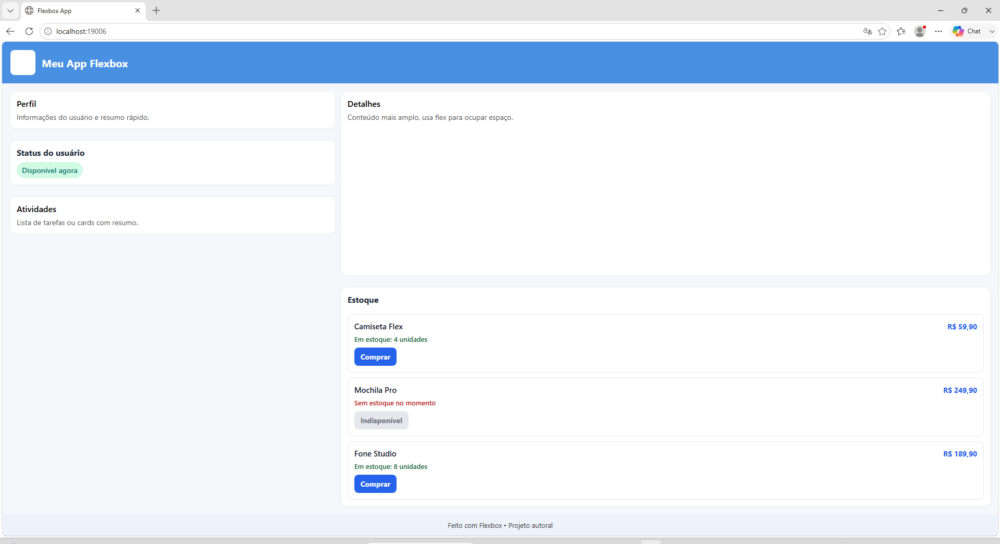
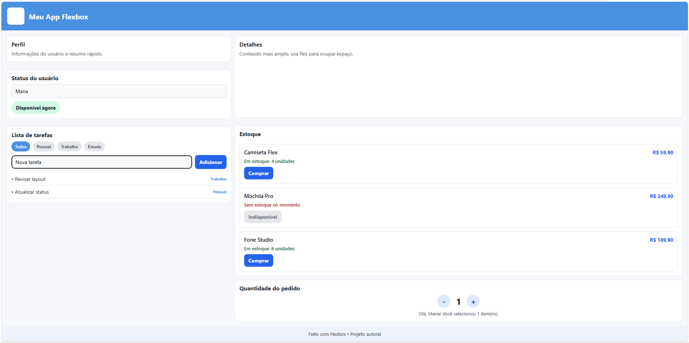
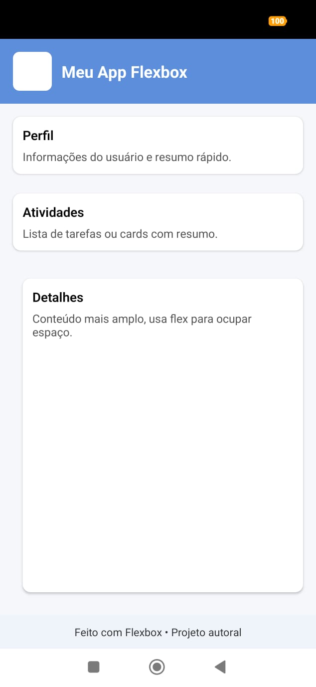
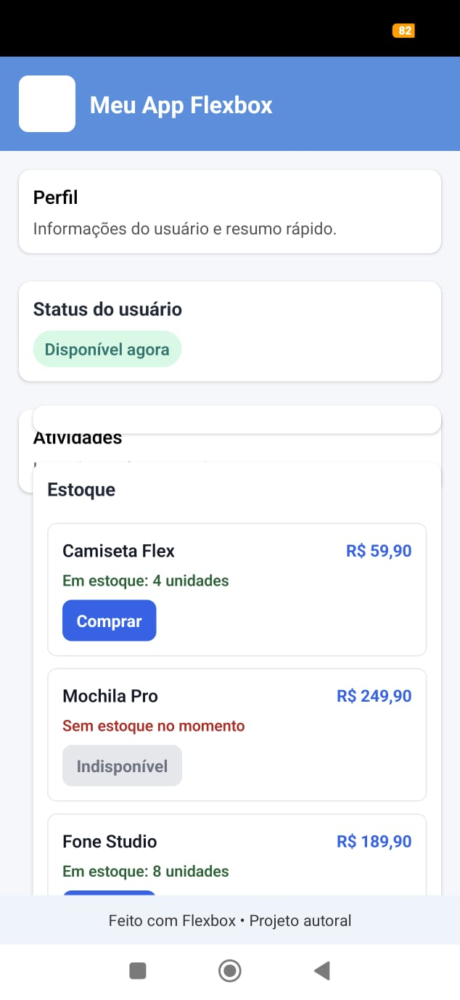
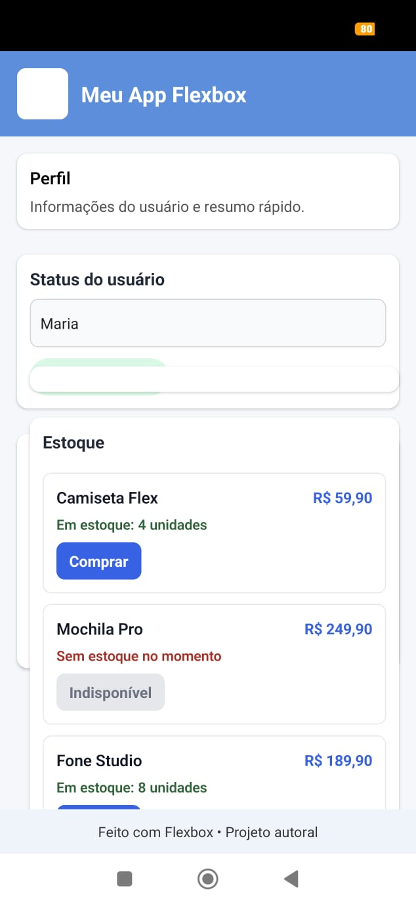

# App Flexbox — Projeto Autoral

Aplicativo desenvolvido em React Native com Expo, com foco em Flexbox, organização visual, renderização condicional e uso de estado com eventos de interação.

## Objetivo

Criar uma interface responsiva e interativa, utilizando:

- `StyleSheet.create()` para estilização em JavaScript
- `flexDirection`, `justifyContent`, `alignItems` e `flex` para layout
- `useState` para controlar estados da interface
- `TextInput`, botões e filtros para interação com o usuário
- componentes reutilizáveis e organização visual do app

## Atividade 3 — Estado e interação

O projeto foi atualizado para incluir exemplos práticos de uso de estado e eventos de interação:

1. Campo de texto controlado
   - o nome do usuário é digitado em um `TextInput` e controlado por estado

2. Toggle de status
   - ao pressionar o botão, o usuário alterna entre online e offline

3. Adição de tarefas
   - o usuário digita o texto da tarefa e a adiciona por meio de botão

4. Filtro de categorias
   - a lista de tarefas pode ser filtrada por categoria

5. Contador de quantidade
   - o usuário aumenta ou diminui a quantidade do pedido por interações

Esses elementos foram integrados ao layout principal de forma coerente com a proposta do projeto, demonstrando estados dinâmicos e respostas a ações do usuário.

## Tecnologias utilizadas

- React Native
- Expo
- JavaScript
- Flexbox
- StyleSheet
- useState
- TextInput
- Pressable

## Estrutura do projeto

- `App.js` — estrutura principal da interface e lógica de estado
- `styles.js` — estilos gerais do app
- `components/Header.js` — cabeçalho do app
- `components/Card.js` — cards reutilizáveis
- `media/` — screenshots do projeto em web e mobile

## Como executar

No PowerShell, na pasta do projeto:

```powershell
cd "C:\Users\Francisco\Desktop\Flexbox"
npm install
npm start
```

Para abrir em navegador web:

```powershell
npx expo start --web
```

Para abrir no Android:

```powershell
npx expo start --android
```

## Repositório GitHub

https://github.com/vieiraassis08-coder/-Dispositivos-M-veis.git

## Screenshots

### Web







### Mobile







## Observações

Este projeto atende às propostas de estilização, renderização condicional e gerenciamento de estado em React Native, demonstrando uso prático de interações do usuário e organização de interface dinâmica.
